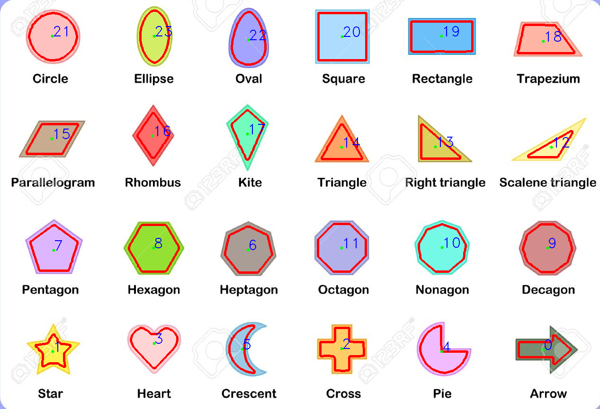
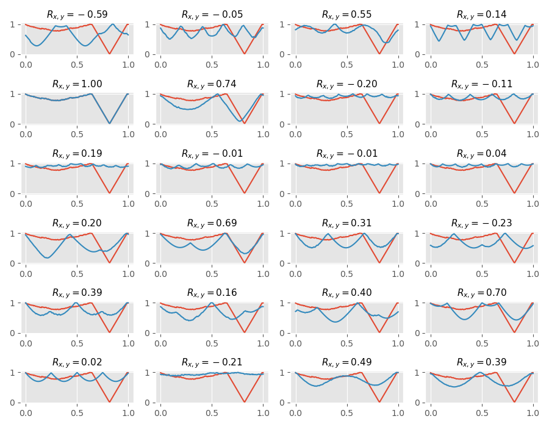
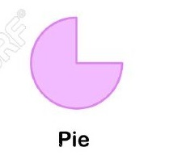
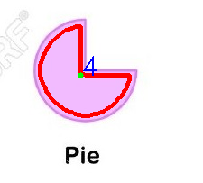

# HW01
## Requirements

`cmake >= 2.8`

`opencv 4.X`

## Assignment description

1. Load image in gray scale.
2. Binarize image nicely  (use possible filters, blur, morpho, etc..).
3. Extract contours.
4. Extract centroids.

5. Compute BOF (Boundary Object Function).
6. Normalize size and scale of BOF 180 elements distance: [0 to 1.0].
7. Create a Dataset with all shapes /save to file to plot.
8. Load a cropped image of a single shape.
9. Extract normalized BOF of loaded shape.
10. Compare with all in data set, and tell witch one it is.

## Results

The next image show the original RGB image with contours (red), centroids (greed dot), and class number (blue text).

To find the BOF class to which the test image belongs,  `main.cpp`computes the correlation coefficient for each BOF in the dataset and the BOF of the tested image.

Then just pick the index of the class with more correlation, and show the result. 

| Test image                    | Binarization                         | BOF result                                    |
| ----------------------------- | ------------------------------------ | --------------------------------------------- |
|  |  |  |

