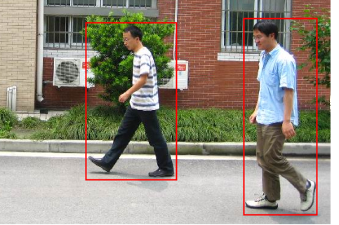

## HW02 - Pedestrians detection

## Requirements

`cmake >= 2.8`

`opencv 4.X`

`fftw 3.X`

## Assignment descriptions

Train  a pedestrian classifier with SVM. Using HOG, LBP and HOG+LBP descriptors. 

## Results

| Descriptor                                     |  Size | % Positives | % Negatives | % Total |
| ---------------------------------------------- | ----: | :---------: | :---------: | :-----: |
| $\text{HOG}_{4 \times 4}$                      | 16740 |   99.707    |   99.667    | 99.688  |
| $\text{HOG}_{8 \times 8}$                      |  3780 |   99.413    |   99.667    | 99.532  |
| $\text{LBP}_{8}$                               |   256 |   99.267    |   99.167    | 99.220  |
| $\text{LBP-HF}_{8}$                            |    38 |   98.974    |   99.833    | 99.376  |
| $\text{LBP-HF}_{16}$                           |   138 |   99.267    |   99.833    | 99.532  |
| $\text{HOG}_{4 \times 4} + \text{LBP}_{8}$     | 16996 |     100     |   99.833    | 99.922  |
| $\text{HOG}_{4 \times 4} + \text{LBP-HF}_{8}$  | 16778 |   99.853    |     100     | 99.922  |
| $\text{HOG}_{4 \times 4} + \text{LBP-HF}_{16}$ | 16878 |   99.853    |   99.833    | 99.844  |
| $\text{HOG}_{8 \times 8} + \text{LBP}_{8}$     |   634 |   99.853    |   99.833    | 99.844  |
| $\text{HOG}_{8 \times 8} + \text{LBP-HF}_{8}$  |   416 |   99.853    |     100     | 99.922  |
| $\text{HOG}_{8 \times 8} + \text{LBP-HF}_{16}$ |   516 |   99.853    |     100     | 99.922  |

