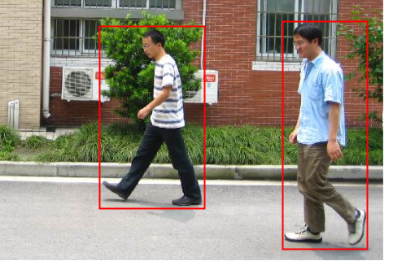

```{r setup, include=FALSE}
knitr::opts_chunk$set(echo = TRUE)
```

# Procesamiento del dataset {#dataset}

## Imágenes positivas
En esta primera parte era necesario separa cada peatón de las imágenes de la base de datos utilizando las anotaciones con los *bounding boxes* (bb) para cada imagen (ver \ref{fig:ped}). Para hacer esto me basé parcialmente en el código que se nos compartió. Para mi era importante simplificar lo más posible el procesamiento de datos para la implementación del clasificador. Así que decidí hacer un programa que se encargara de recortar y normalizar estas imágenes (a un tamaño de $64 \times 128$) y almacenarlas en un directorio que después seria accedido por los diferentes programas para cada clasificador.

```{r ped, echo=FALSE, fig.align='center', fig.pos='H', fig.cap="Muestra de la base de datos de positivos con BB", out.width='65%'}

```

Todo este proceso se realiza en el programa `generate_neg.cpp`. Este es el encargado de leer las imágenes originales y las anotaciones de los bb para recortar y después redimensionar las imágenes a $64 \times 128$ pixeles. Este proceso esta ilustrado en la figura \ref{fig:ped_cropped}. El resultado de este procesamiento fueron 341 muestras positivas para el entrenamiento (sin *data augmentation*) y 85 muestras para la prueba de validación.

```{r ped_cropped,  echo=FALSE, fig.align='center', fig.pos='H', fig.cap="Pre-procesamiento de las imagenes de positivos", out.width='80%'}

```

## Imágenes negativas
Para generar el set de datos de los negativos se generaron *patches* de tamaño y posición aleatoria dentro del conjunto de imágenes negativas que después fueron normalizadas de igual forma que las positivas (ver figura \ref{fig:neg_patches}). El proceso se realiza en el programa `generate_neg.cpp`, que básicamente es:

1. Selecciona una imagen del conjunto de negativos
2. Se genera un valor aleatorio para el largo (w) y ancho (h) dentro de los límites de la imagen.
3. Se genera una posición (x,y) aleatoria que respete los límites de la imagen y el tamaño (w,h) generado.
4. Se recorta el *patche* de la imagen original.
5. Se normaliza el *patche* a la dimensión de $64 \times 128$
6. Se respalda la imagen normalizada

En total el programa genera 600 muestras para el entrenamiento de las imágenes 1-4 originales (150 de cada una) y 160 imágenes para la prueba de validación de las imágenes 5-6 (80 de cada una).

```{r neg_patches, echo=FALSE, fig.align='center', fig.pos='H', fig.cap="Patches aleatorios normalizados generados apartir de una muestra del conjunto de negativos", out.width='80%'}

```

# Clasificación con SVM

En total se generaron 3 programas para detectar peatones utilizando Suppurt Vector Machine (SVM) entrenados con descriptores de Histograms of Oriented Gradients (HOG), Local Binary Pattern (LBP) y una combinación de ambos. Cada uno se entrenó con los mismos datos de entrenamiento y fueron probados con los datos de validación generados de en la sección \ref{dataset}. Además, se probaron diferentes versiones de cada clasificador modificando los parámetros del descriptor HOG (*block size, blocke stride, cell size*) y del LBP (*samples, radius, mapping type*) generando un total de 11 clasificadores.

Los tres programas base de los detectores (`svm_hog.cpp, sv_lbp.cpp, svm_lbp_hog.cpp`) comparten la misma estructura en su programación, cada programa tiene 3 fases:

1. Procesamiento de los datos de entrenamiento.
2. Entrenamiento del SVM.
3. Prueba del SVM con los datos de validación.

## Clasificador con descriptor HOG
Para generar los descriptores de este clasificador se utilizó el objeto `HOGDescriptor` de la clase `objdetect` de OpenCV. El constructor de este objeto requiere de los siguientes parámetros:

* **wind_size**: Tamaño de detección de la ventana. Este parámetro se dejó fijo en (64,128).
* **block_size**: Es el tamaño del bloque en píxeles y debe de estar alineado con el *cell_size*. Este parámetro sé vario entre (8,8) y (16, 16)
* **block_stride**: Es el paso del bloque, este valor debe de ser múltiplo del *cell_size*. Este parámetro sé vario entre (4,4) y (8,8).
* **cell_size**: Es el tamaño de la celda. Este parámetro sé vario entre (4,4) y (8,8).
* **nbins**: Es el número de *bins* o barras en el histograma generado por la función. Este parámetro se dejó fijo en 9.

El descriptor generado con un `block_size = (8,8)` y `cell_size = (4, 4)` genera un descriptor de 16740 elementos. Mientras que con la configuración de `block_size = (16, 16)` y `cell_size = (8, 8)` obtenemos un descriptor de 3780 elementos. Los resultados de ambos clasificadores se encuentra en la sección \ref{results}.

## Clasificador con descriptor LBP
El algoritmo de LBP genera un descriptor de la textura de la imagen en un arreglo en 2D, para poder entrenar el SVM es necesario calcular un histograma de este arreglo en 2D. Pero, el primer inconveniente que encontré fue que la implementación de OpenCV si calcula un LBP pero **estrictamente** en el contexto de reconocimiento de caras.

Así que decidí utilizar la [implementación de Nvid Nourani-Vatani de LBP](https://github.com/nourani/LBP). Esta es una librería en C++ que integra OpenCV y FFTW3 para hacer un cómputo eficiente (incluso en GPU) de los descriptores más populares con LBP: U2, R1, RIU2 y HF. Para hacerla funcionar el único requisito es compilar la librería de [FFTW](http://www.fftw.org/), que es una librería para la transformada de Fourier discreta (DFT) escrita en C.

Con esta implementación de LBP se puede generar un histograma **normalizado** de 256 *bins* de los valores del LBP de la imagen. Y además puede generar el Local Binary Pattern-Histogram Fourier (LBP-HF), que es un meto todo basado en LBP invariante a la rotación. Ambos descriptores son usados para entrenar diferentes versiones de este clasificador.

Para el entrenamiento se modificaron algunos parámetros del descriptor LBP:

* **samples**: Es el número de puntos de la circunferencia que rodean al píxel. Este parámetro sé vario entre 8 y 16.
* **radius**: Es la distancia en píxeles de los vecinos al píxel evaluado. Este parámetro se dejó fijo en 1.
* **mapping_type**: Con este parámetro la librería te permite escoger entre el tipo de descriptor generado (LBP uniforme o LBP-HF).

Los resultados de las diferentes versiones de este clasificador se muestran en la sección \ref{results}.

## Clasificador con HOG y LBP
Para entrenar este clasificador inicialmente solo se concatenó el descriptor generado con HOG y aquel generado con LBP que después fue enviado al SVM para su entrenamiento. Pero las primeras pruebas arrojaron los mismos resultados del clasificador de HOG. Ante esta situación se probaron diferentes parámetros para el descriptor de LBP, pero tampoco hacían diferencia en los resultados de clasificación.

Después de hacer un análisis de los datos generados por ambos descriptores, se llegó a la conclusión de que la magnitud del vector generado por el descriptor de HOG era mucho mayor que la magnitud generada por el histograma normalizado de LBP que era igual a 1. Esto causaba que la contribución de los datos del vector de LBP se *desvaneciaran* frente a aquellos del vector de HOG. Así que sé probo **normalizando** el vector de HOG para convertirlo en un **vector unitario**. Esta modificación mostró resultados más satisfactorios. En la sección \ref{results} se puede ver los resultados de las diferentes versiones de este clasificador generadas a partir de las combinaciones de parámetros de los descriptores HOG y LBP.

# Resultados {#results}

En la siguiente tabla, la columna *tamaño* hace referencia al tamaño del descriptor, el subíndice de los descriptores de HOG representan el `cell_size`, y el subíndice de aquellos con LBP representa el número de `samples`.

| Descriptor | Tamaño | % Positivos | % Negativos | % Total |
| ---------- | ------:|:-----------:|:-----------:|:-------:|
| $\text{HOG}_{4 \times 4}$ | 16740 | 98.82 | 98.75 | 98.36 |
| $\text{HOG}_{8 \times 8}$ | 3780 | 97.64 | 98.75 | 97.55 |
| $\text{LBP}_{8}$ | 256 | 97.05 | 96.87 | 95.91 |
| $\text{LBP-HF}_{8}$ | 38 | 95.88 | 99.37 | 96.73 |
| $\text{LBP-HF}_{16}$ | 138 | 97.05 | 99.37 | 97.55 |
| $\text{HOG}_{4 \times 4} + \text{LBP}_{8}$ | 16996 | 100 | 99.37 | 99.59 |
| $\text{HOG}_{4 \times 4} + \text{LBP-HF}_{8}$ | 16778 | 99.41 | 100 | 99.59 |
| $\text{HOG}_{4 \times 4} + \text{LBP-HF}_{16}$ | 16878 | 99.41 | 99.37 | 99.18 |
| $\text{HOG}_{8 \times 8} + \text{LBP}_{8}$ | 634 | 99.41 | 99.37 | 99.18 |
| $\text{HOG}_{8 \times 8} + \text{LBP-HF}_{8}$ | 416 | 99.41 | 100 | 99.59 |
| $\text{HOG}_{8 \times 8} + \text{LBP-HF}_{16}$ | 516 | 99.41 | 100 | 99.59 |

\newpage
# Referencias